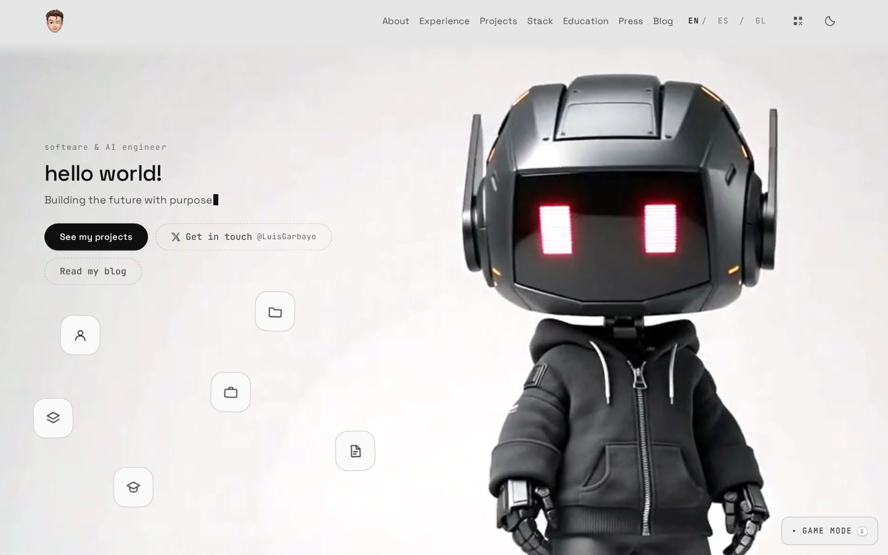
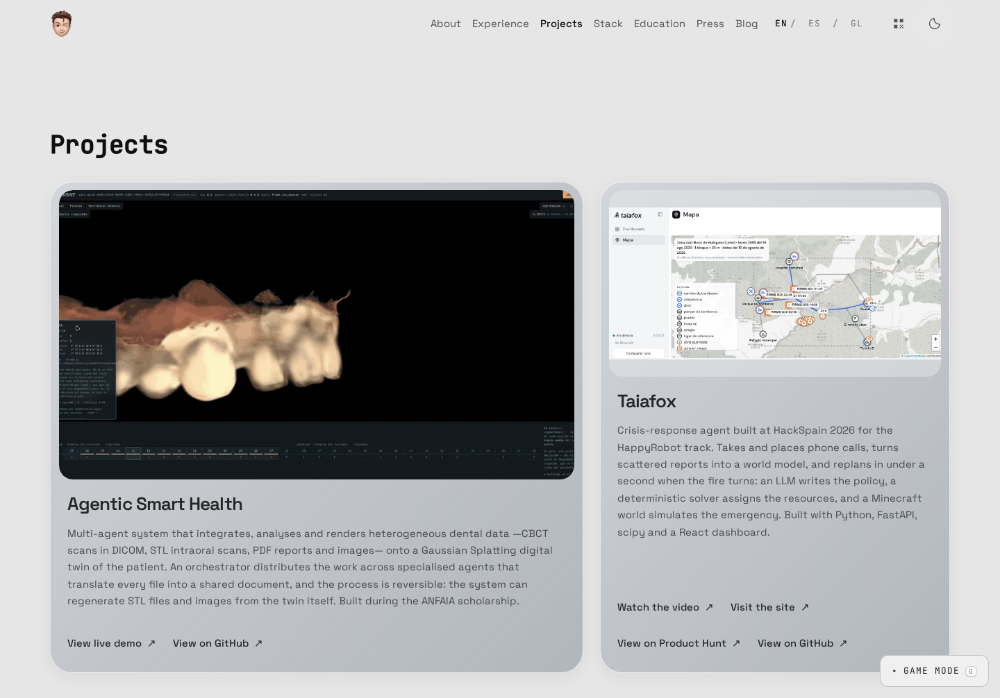
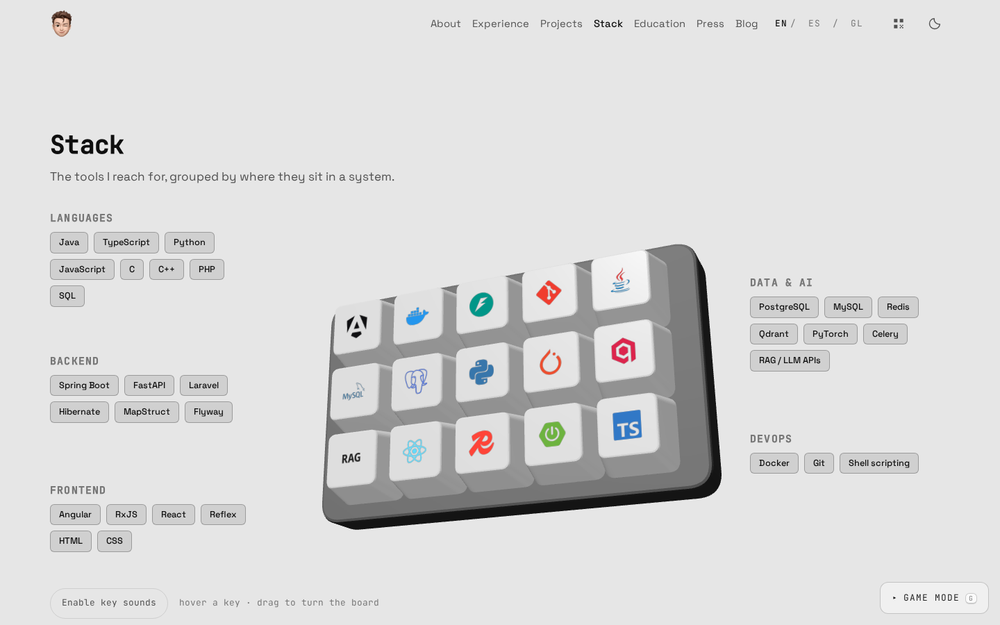
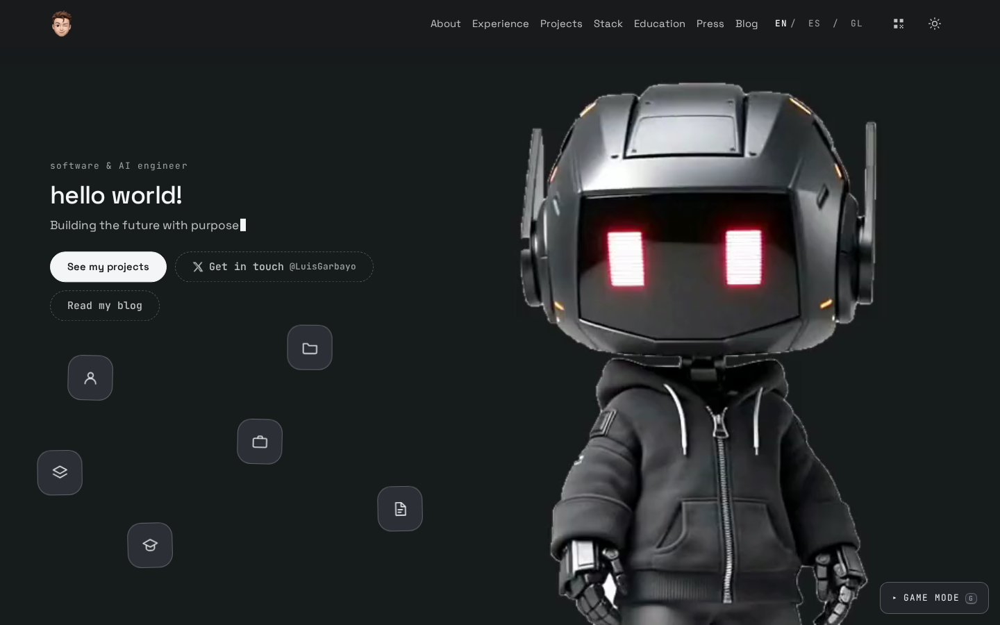
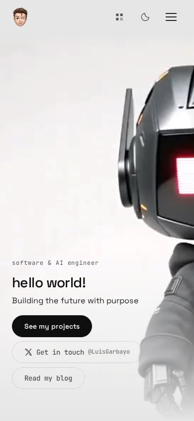
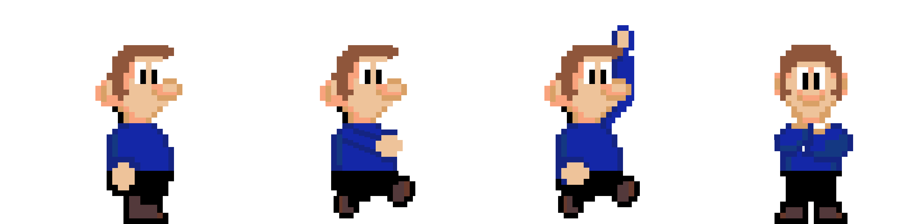

# Luis Garbayo — Portfolio

> Software & AI engineering, healthcare technology, and a playable portfolio.

[Visit lgarbayo.com](https://lgarbayo.com) · [Blog](https://lgarbayo.com/en/blog/)



## About

My personal portfolio brings together my work in software and AI, with a particular
interest in healthcare and building technology that improves people's lives.

The site is available in **English, Spanish and Galician**, with a responsive layout,
light and dark themes, and a blog. Its original 2D game remains available through
**Game Mode**, using the same portfolio content as the main website.

## Website previews

### Projects

Silver glass cards show project screenshots, descriptions and links to repositories,
demos and other resources. Cards highlight on hover and keyboard focus.



### Interactive stack

A 3D keyboard displays technology logos in color. Hover or tap a key to explore it,
drag to rotate the board, and optionally enable key sounds. The technology lists remain
readable when WebGL or animation is unavailable.



<details>
<summary>Dark theme and mobile hero</summary>

The hero has matching light and dark media. On mobile, it uses a still image and
the header menu provides section navigation.





</details>

Screenshots are stored in `docs/images/` and show the local production build.

## Portfolio sections

- **About:** a short introduction, Ourense location link, portrait and English/Spanish CVs.
- **Experience:** current and previous roles, organization logos and selected project images.
- **Projects:** featured work and smaller cards for other activities.
- **Stack:** an interactive keyboard and technology categories.
- **Education:** degrees with image galleries, language cards and certifications.
- **In the press:** links to coverage in HISTORA, Faro de Vigo, La Voz de Galicia,
  Atlántico and La Región.
- **Blog:** article cards with linked motion previews and localized RSS feeds.

## Game Mode

Inspired by the **iconic worlds of Super Mario Bros**, the game features custom-designed
character sprites and four worlds — about, projects, experience and contact — that blend
nostalgia with the portfolio. Its panels share the website's profile, projects,
experience, education, languages, certifications, activities and press links.



## Tech Stack

**Astro** and **TypeScript** for the site, **Phaser 3** for the game, **GSAP** and
**Three.js** for the motion layer.

The engines load on demand: Phaser only when you open game mode, Three.js only when the
sections that need it scroll into view. `npm run build` fails if either one ends up in a
page's initial payload.

## Development

```bash
npm install
npm run dev      # local dev server
npm run build    # type check, build, translation coverage, asset and bundle checks
npm run preview  # serve the production build
```

The development server defaults to `http://localhost:4321`. Opening `/` selects
the visitor's language and lands on the hero; the header portrait also returns there.

For a quick validation without generating a production build:

```bash
npm run check
npm run coverage:i18n
```

## Structure

```text
src/
  content/      portfolio content as validated collections (one file per entry, per locale)
  i18n/         interface strings (en.json is the contract; es.json and gl.json translate it)
  components/   layout, sections and the game launcher
  game/         the Phaser game — host.ts is its only entry point
  lib/          shared data and client behaviour (press, profile, themes, 3D, game lifecycle)
public/assets/  committed images, video, logos, flags and game assets
docs/images/    website screenshots used in this README
scripts/        build-time checks and optional hero media processing
```

Adding a project, a job or a blog post means adding a file under `src/content/` — no
component needs editing.

Press articles live in `src/lib/press.ts`. Project selection and order are shared
through `getPortfolioProjects()` in `src/lib/content.ts`, so the website and Game Mode
show the same projects.

## Content and locales

English is the default locale. `/en/`, `/es/` and `/gl/` are all prefixed, and `/` redirects
based on stored preference, then browser language. Content falls back to English when a
translation is missing — blog posts included: they are listed in every locale, labelled as
untranslated, and link to the URL where the article actually exists.

Adding a locale means adding it to `src/i18n/config.ts` (which also holds the BCP-47 tag used
for date formatting), a `src/i18n/<code>.json` dictionary, and one `<slug>.<code>.md` per
content entry. `npm run build` reports what is still missing.

Astro watches content files while `npm run dev` is running. Keep `.astro/` intact:
the development server uses its generated files and content store. Neither `dev`
nor `build` deletes this directory, so a build can run alongside the development server.

## Blog

Articles are Markdown files in `src/content/posts/`, named `<slug>.<locale>.md` like the rest
of the content. Four fields are required — `title`, `description`, `pubDate` and `slug` — and
`draft: true` keeps a post visible in `npm run dev` while hiding it from production, the feed
and the sitemap. An optional `motion` clip (with its `motionAlt`) appears at the top of
the article card and links to the article; it only plays on screen, and never with
reduced motion.

Every locale gets a feed at `/<locale>/rss.xml`. Opening one in a browser shows a readable
page rather than raw XML — that is `public/rss/styles.xsl`, a stylesheet the browser applies
on its own, leaving the file itself untouched for feed readers. The Blog link appears in the
header only once a published post exists.

## Analytics

Google Analytics 4, and it stays off unless you turn it on. The whole thing hangs off one
environment variable:

```bash
PUBLIC_GA_ID=G-XXXXXXXXXX   # Analytics → Admin → Data streams → the web stream
```

Leave it unset — as `.env.example` does — and no tag, no consent banner and no request to
Google survive the build. That is the default for local work and for anyone who clones this.

Two things the default GA setup would get wrong here, both handled in code:

- **Navigation is client-side.** The `ClientRouter` moves between pages with `pushState`, so
  the automatic page view only ever fires once. Page views are sent by hand on
  `astro:page-load`, after the swap, which is the only moment the title is right. Turn off
  *Page changes based on browser history events* in Enhanced Measurement or every navigation
  counts twice.
- **Most of the site isn't a link.** The QR, the CV viewer, game mode, the 3D figure, the
  keyboard scene, the shortcuts — none of them change the URL. They send their own events,
  declared either as `data-track` attributes in the markup or as `track()` calls in the
  module that owns the interaction.

Consent is Google's consent mode, denied by default, and only for measurement: the three
advertising signals stay denied for good and are never asked about.

`src/lib/analytics.ts` has the full reasoning and the event list.

## Hero media

The hero plates and posters are committed in `public/assets/ui`, so a build never
touches an AI service or re-encodes anything. Four videos ship, one per theme and
codec:

| | AV1 (1920×1092) | H.264 (960×546) |
| --- | --- | --- |
| light | `hero-figure.av1.mp4` | `hero-figure.mp4` |
| dark | `hero-figure-dark.av1.mp4` | `hero-figure-dark.mp4` |

AV1 is what almost everyone gets; H.264 is the fallback for Safari below 17 and
Intel Macs, which cannot decode AV1. `src/lib/hero-video.ts` asks `canPlayType`
rather than sniffing versions, because AV1 support depends on the hardware. Every
frame is a keyframe in both — the video is never played, it is scrubbed frame by
frame against the cursor, and without all-intra encoding seeking stutters.

### Regenerating them

Three steps, and only the first needs a GPU. Sources live in the gitignored
`assets-src/`.

```bash
# 1. One-off: 1280×720 render -> 2560×1440 source. Needs an NVIDIA GPU,
#    PyTorch with CUDA and spandrel.
python3 scripts/upscale-hero-source.py

# 2. Light plates and posters. Needs FFmpeg with libsvtav1 and libx264.
node scripts/make-hero-figure.mjs

# 3. Dark plates and posters, derived from the light AV1 one.
#    Also needs NumPy and OpenCV.
python3 scripts/make-hero-dark.py
```

Step 1 exists because the plate is the hero's *background*, so it stretches to the
window width: at 960px that was a 3.1× upscale on a 14" MacBook Pro and 5.3× on a
5K display. Real-ESRGAN reconstructs the detail that plain interpolation only
blurs. Each script's header explains the measurements behind its constants.

The model weights are **not** committed — 64 MB for a step that runs once. Fetch
them into the ignored `assets-src/models/` before running step 1:

```bash
hf download ai-forever/Real-ESRGAN RealESRGAN_x2.pth --local-dir assets-src/models
```

`upscale-hero-source.py` takes an alternative path as its first argument if you
keep them elsewhere.

Step 3 replaces the background with `#181a1d` using a foreground mask, preserving
the robot's eyes and highlights. The theme picks the matching video and stills.

## License

MIT — see [LICENSE.md](LICENSE.md).

© 2026 Luis Garbayo Fernández

## Additional Credits

- **Character Sprite**: Custom design by Luis Garbayo Fernández
- **Game Inspiration**: Super Mario Bros® is a registered trademark of Nintendo Co., Ltd.
  This project is a personal portfolio and is not affiliated with, endorsed by, or connected to Nintendo.
